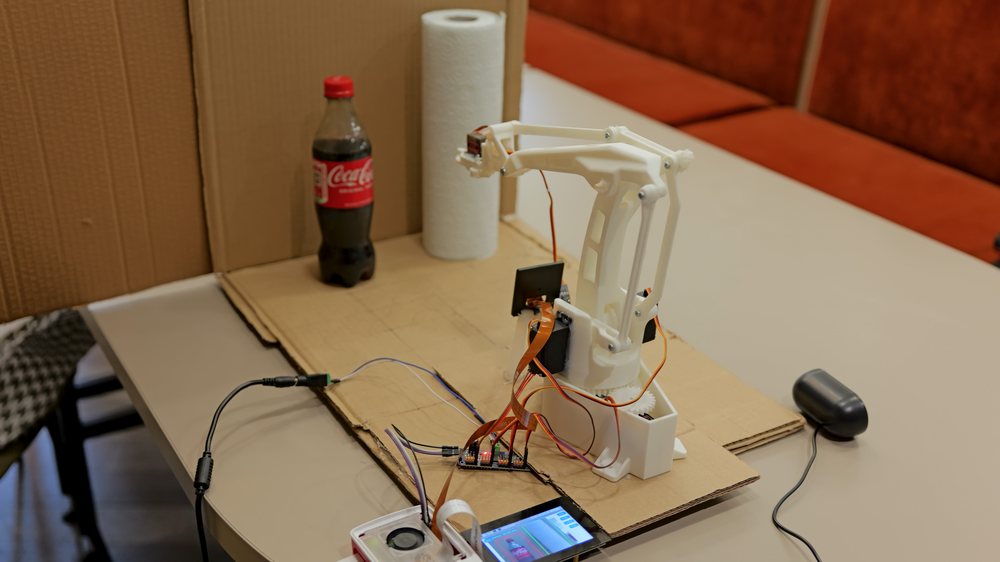

# CogniArm: A Learnable Robotic Arm System

## 📚 Table of Contents

- [Introduction](#introduction)
- [Features](#features)
- [Hardware Requirements](#hardware-requirements)
- [Quick Start](#quick-start)
- [Tips for voice interaction](#tips-for-voice-interaction)
- [Social Media](#social-media)
- [Team Contribution](#team-contribution)
- [License](#license)

[Architecture]
- [System Architecture](./docs/ARCHITECTURE.md#system-architecture)
- [Technical Documentation](./docs/ARCHITECTURE.md#technical-documentation)
- [Project Structure](./docs/ARCHITECTURE.md#project-structure)
- [Known Issues](./docs/ARCHITECTURE.md#known-issues)

[Test]
- [Module Testing](./docs/test_data/TEST.md#module-testing)
- [Latency Testing](./docs/test_data/TEST.md#latency-testing)

[Roadmap]
- [v2.0 Highlights](./docs/ROADMAP.md#v20-highlights)
- [Future Work](./docs/ROADMAP.md#future-work)
- [Previous Research](./docs/ROADMAP.md#previous-research)


## Introduction

As of April 13, 2026, the first version of our project has been officially released.

**Latest Update (CogniArm 2.0 – 20 April 2026):**
- Improved the Quick Start section [Quick Start](#quick-start)
- Added hardware connection documentation [Hardware](#hardware-requirements)
- Added an individual module testing section[Module Test](./docs/test_data/TEST.md#module-testing)
- Added voice interaction guidance [Voice Interaction](#tips-for-voice-interaction)
- Designed more documents and self inspections on scoring criteria [Technical Documentation](./docs/ARCHITECTURE.md#technical-documentation)
- Introduced CogniArm v2.0 highlights with detailed description of updates [v2.0 Highlights](./docs/ROADMAP.md#v20-highlights)

This project is a real-time embedded robotic system based on C++, designed with a Producer–Decision–Executor-Supervisor architecture.  
It supports voice interaction, visual perception, and motion learning.

**CogniArm is not just a robotic arm that can move**  

**it is more like a prototype of an embedded intelligent agent that can learn, understand, and execute tasks.**


For a detailed overview, see [Project Overview](./docs/ROADMAP.md#previous-research),These documents also include the initial project planning during the early development stage, as well as several minor updates made prior to the official release.

---

##  Features

- 🎤 Speech recognition and command parsing (Microphone + NLU)
- 👁️ Visual detection (OpenCV)
- 🤖 Motion learning and execution system
- 🧠 Producer–Decision–Executor-Supervisor architecture (enhanced in v2.0)
- 🖥️ Embedded UI based on LVGL

more detail can see our demo video! 
[video](https://youtu.be/HwtmvhdDly4)

---

## Hardware Requirements

| Component        | Model / Specification                | Description                          |
|------------------|-------------------------------------|--------------------------------------|
| Main Controller  | Raspberry Pi 5 (4GB)               | Core processing unit                 |
| Camera Module    | Raspberry Pi Camera Module 3       | Vision input                         |
| Microphone       | VEETOP USB Microphone              | Audio input                          |
| Speaker          | USB Speaker                        | Audio output                         |
| Servo Driver     | PCA9685                            | PWM controller (I2C)                 |
| Servos           | MG996R (x3), MG90 (x1)             | Robotic arm actuators                |
| Display (Optional)| OSOYOO 3.5-inch DSI touchscreen   | User interface                       |
| Robotic Arm      | EEZYbotARM Mk2                     | Mechanical structure                 |
| Power Supply     | External 5V Power Supply (for PCA9685) | Required for stable servo operation |


[back to Contents](#-table-of-contents)

---

## Quick Start

Follow these steps to set up the environment and verify your hardware before running the project.

### step 0: Assembly of robotic arm

The overall reproduction of this project relies on the robotic arm, 

and the 3D printing drawings and installation methods of the robotic arm are as follows:

- *Ref:* [Instructables Guide](https://www.instructables.com/EEZYbotARM-Mk2-3D-Printed-Robot/) | [Thingiverse Files](https://www.thingiverse.com/thing:1454048)

We provide. 3mf files that may be used for 3D printing, with the following path:

*hardware/3mf*

*hardware/_3mf/EBAmk2.3mf*

#### Note

**If you have already assembled the robotic arm**, it may exhibit large or unexpected movements during the initial startup, possibly even exceeding its mechanical limits. This is because the initial servo values may have been modified.

Please interrupt the program during execution using Ctrl + C, and then adjust the initial configuration of each servo in the file *include/common/servo_config.hpp*.

**If you have not yet assembled the robotic arm**, please connect the wiring (servo → PCA9685 → Raspberry Pi 5) before mounting the servos onto the arm, and run the program once.

After that, please do not manually adjust the servo angles when the program is stopped. Thank you.

Minor angle adjustments are fine. The initial angles and angle limits can be modified at any time during later use in *include/common/servo_config.hpp*.

### step 1: Hardware connection

Please connect the Raspberry Pi 5 to the hardware according to the diagram or table below.


<p align="center">
  
</p>


#### Raspberry Pi to PCA9685 Connection
| Raspberry Pi Pin | PCA9685 | Function |
|------------------|--------|----------|
| Pin 1            | VCC    | Power    |
| Pin 3            | SDA    | Data     |
| Pin 5            | SCL    | Clock    |
| Pin 6            | GND    | Ground   |


#### Servo Wiring
| Wire Color | Function |
|-----------|----------|
| Brown     | GND      |
| Red       | VCC (+5V)|
| Yellow    | PWM      |

#### Note
> The screen is not required. You can use VNC to connect to and control the Raspberry Pi remotely.
>
> **Do NOT** connect the MG996R servo directly to the Raspberry Pi 5. During operation, please use an external power supply to power the PCA9685 board.


---

### step 2: Clone

After connecting the hardware, please connect the Raspberry Pi 5 to your computer.   
If you encounter any issues at this step, refer to [Setup Guide](docs/helper/setup_guide.md), which contains relevant instructions for connection as well as some Raspberry Pi commands.  

After ensuring that your computer is properly connected to the Raspberry Pi 5, please run the following command to clone our repository.

```bash
git clone https://github.com/milars-z/Real-Time-Embedded-Programming.git
```

---

### Step 3: Environment Setup

libasound2-dev         -- ues for microphone and speaker
nlohmann-json3-dev     -- json file process
libopencv-dev          -- image processing
libsdl2-dev            -- use for screen
libcamera-apps         -- use for camera
gstreamer1.0-libcamera -- use for camera
libcamera-v4l2         -- use for camera
libonnxruntime-dev     -- use for inference engine
cmake                  -- general package
build-essential        -- general package

You can choose either of the following methods to install the required dependencies.

- 1. command(You can manually install any packages you are missing)

```bash
sudo apt update
sudo apt install -y build-essential libasound2-dev nlohmann-json3-dev libopencv-dev
sudo apt install -y libsdl2-dev libcamera-apps gstreamer1.0-libcamera libcamera-v4l2 libonnxruntime-dev
```

- 2. bash

```bash
cd Real-Time-Embedded-Programming
bash setup.sh
```

This step may take a considerable amount of time and could require **more than 10 minutes**. Please be patient.  

---

### Step 4: Camera Verification 
Ensure your camera is correctly connected and recognized by the system.  

```bash
rpicam-hello --list-cameras
```

Check: If no camera is detected, please check the ribbon cable connection.

---

### Step 5: Enable I2C Interface

The robot arm's servo controller requires I2C communication.
Open and edit the configuration file:
```bash
sudo nano /boot/firmware/config.txt
```

Ensure the following line is present and not commented out:
```bash
dtparam=i2c_arm=on
```
Save and Exit (*Ctrl+O*, *Enter*, *Ctrl+X*), then **reboot** your Raspberry Pi.

or you can activate your iic in command
```bash
sudo raspi-config
```

choose 3-Interface Options  
choose I5 - IIC  
Yes  

---

### Step 6: Audio Hardware Configuration

Audio devices often vary. You must verify your speaker and microphone names and update the project configuration if necessary.

- 1.Check Recording Device (Microphone)

```bash
arecord -l
```
Look for the name inside the [].  
Requirement: The name should contain UACDemo.  
Example: card 2: UACDemoV10 [UACDemoV1.0], device 0...  

If it does not contain UACDemo, you must manually update the device string in include/commom/config.h  
edit SPEAKER_NAME  

- 2.Check Playback Device (Speaker)
```bash
aplay -l
```
Look for the name inside the [].  
Requirement: The name should contain USB PnP.  
Example: card 2: Device [USB PnP Sound Device], device 0...  

If it does not contain USB PnP, you must manually update the device string in include/commom/config.h  
edit MIC_NAME  

---

### Step 7:build and start!

```bash
cd Real-Time-Embedded-Programming
mkdir build
cd build
cmake ..
make
./main
```

### Note:

The screen is not required for this project, but it is recommended to use one for a better and easier experience (as the NLU and voice control are not very stable at this stage).

If no screen is available, it is recommended to use VNC for viewing and control. The configuration requirements are as follows:

```bash
sudo raspi-config
``` 

choose 3-Interface Options  
choose I3 - VNC  
Yes  

Then you can use VNC to connect to the Raspberry Pi and view the screen in real time.

### After runing

The system should print initialization logs:

<p align="center">
  
</p>

Or it may directly display the initial interface, as shown in the figure below.

<p align="center">
  
</p>

You can also check the command output window again to determine whether the program has started successfully. During the startup phase, under normal conditions, all outputs should be in the format **[Init] xxxx**  

If everything is working properly, feel free to enjoy interacting with the robot. You can try clicking motion to teach it a new motion, or camera to let it learn a new object feature. You can also change its name or how it addresses you.
Here are some tips for voice interaction [Tips for Voice Interaction](#tips-for-voice-interaction)


### Note
> It is strongly recommended to use an external power supply for the PCA9685 board instead of powering servos directly from the Raspberry Pi.

[back to Contents](#-table-of-contents)

---

## Tips for voice interaction

### basic commond

Due to limitations in the current NLU implementation and microphone performance, speech recognition may not be highly accurate. The following commands are reliably recognized and can help you quickly interact with the system using voice:

| Command                            | Intent        | Value  |
|-----------------------------------|--------------|--------|
| `hello`                           | greet                | —      |
| `what's my name`                  | check_host           | —      |
| `what's your name`                | check_robot          | —      |
| `i teach you how to dance`        | learn_motion         | dance  |
| `do motion dance`                 | do_motion            | dance  |
| `this is apple`                   | learn_object         | apple  |
| `find the apple`                  | find_object          | apple  |
| `reset`                           | reset                | —      |
| `update`                          | update_background    | —      |

### Motion Learning Command Mapping

During the motion learning phase, voice commands are mapped into joint control actions as follows:

#### Joint Selection

| Command    | Target Joint |
|------------|-------------|
| `base`     | Base        |
| `shoulder` | Shoulder    |
| `elbow`    | Elbow       |
| `hand`     | Hand        |

---

#### Direction Control

| Command      | Action Direction |
|--------------|------------------|
| `left`       | Move left        |
| `right`      | Move right       |
| `up`         | Move up          |
| `down`       | Move down        |
| `forward`    | Move forward     |
| `back`       | Move backward    |

---

#### Control Commands

| Command            | Function            |
|--------------------|---------------------|
| `finish` / `stop` / `done` | Exit learning mode |

---

> **Note**
> Direction commands are shared across all joints.
>
> It is recommended to avoid using `down`, as it may be confused with `done`.  
> Instead, use `left` or `back` as alternative commands when possible.


### Usage Notes

Please keep the following points in mind during usage. Although the robot provides feedback, these tips will help ensure better performance:

1. Before performing object learning or detection, please update the background and ensure that the scene remains relatively stable. After the robotic arm locates an object, it may block the camera and affect detection. For more reliable results, it is recommended to perform a `reset` beforehand.

2. The robotic arm may occasionally enter motion learning mode unintentionally. In this mode, only motion-related commands will be processed correctly. All other inputs will receive the response: `what's do you mean`.  
You can exit this mode by using the `finish` command or by clicking **confirm** on the screen.

[back to Contents](#-table-of-contents)

---

## Social Media

Watch our official demonstration video to see **CogniArm** in action! 

[](https://youtu.be/HwtmvhdDly4)

> 🎥 **[Click here to watch the full CogniArm System Demonstration on YouTube](https://youtu.be/HwtmvhdDly4)**

In this comprehensive demonstration, we showcase the core capabilities of our embedded intelligent agent:

- 🤖 **Interactive Motion Learning:** Watch how the robot learns new custom motion sequences (such as waving "hello" or "fly") from scratch through physical guidance and voice commands.
- 👁️ **Lightweight Visual Recognition:** See our feature detection in action as CogniArm learns to recognize and accurately locate specific objects (like a paper roll or a cola bottle), even when other items are present in the scene.
- 🗣️ **Voice Control & Customization:** Discover the seamless interaction via the embedded UI and real-time voice commands, including customizable host and robot names.
- ⚡ **Low-Latency Architecture:** Experience the efficiency of our fully decoupled Producer-Decision-Executor-Supervisor closed-loop system, which optimizes task response times to under 0.5 seconds.

**CogniArm** is more than just a moving arm; it is a general-purpose robotic architecture and a prototype for an embedded intelligent agent.


## Team Contribution

| Name            | Responsibility                                                                 |
| ---------       | ------------------------------------------------------------------------------ |
| Ziyin Zeng      | System architecture design, core module implementation, system integration，and hardware selection and assembly |
| Shantong Wang   | Social media, video production, and camera–motion coordinate transformation                       |
| Longyi Chen     | YOLO model design, system testing data analysis and optimize Doxygen code specifications          |
| Dingyan Guo     | 3D printing, integrate hardware modules list and text translation                              |
| Hang Liu        | IK documentation and text translation                                                      |

[back to Contents](#-table-of-contents)

## License

GPL License

---


