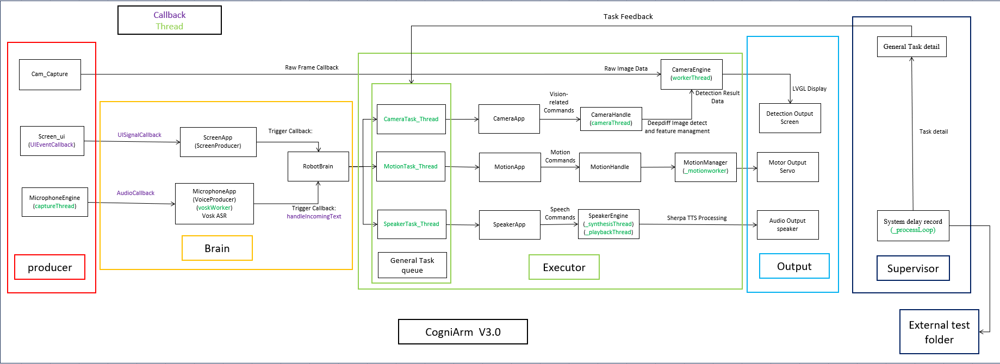
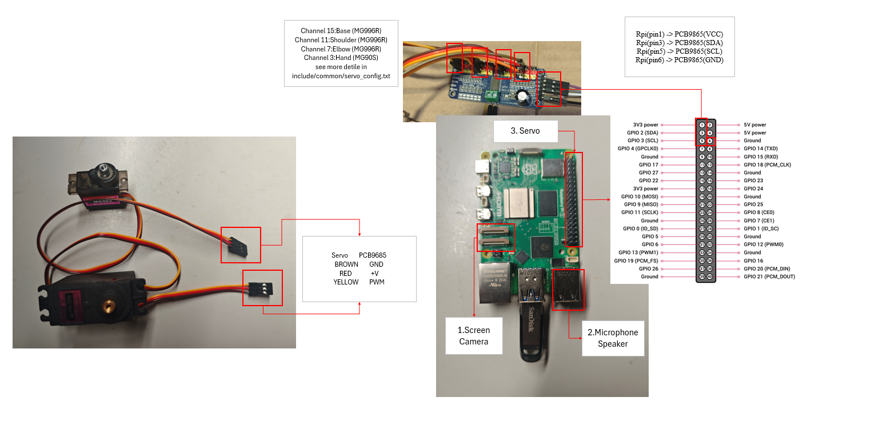
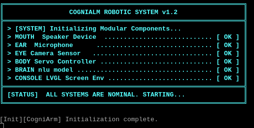
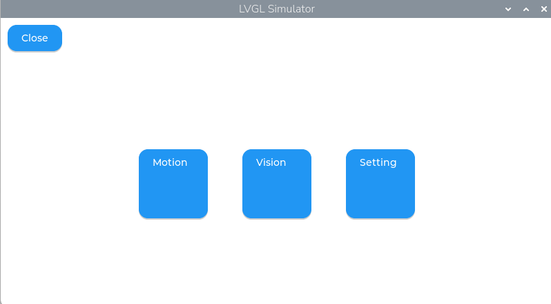
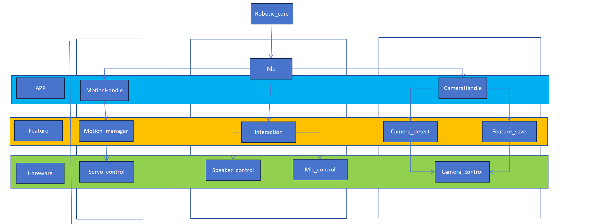
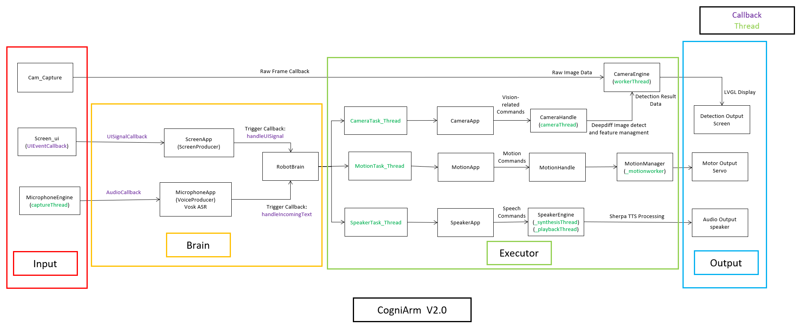
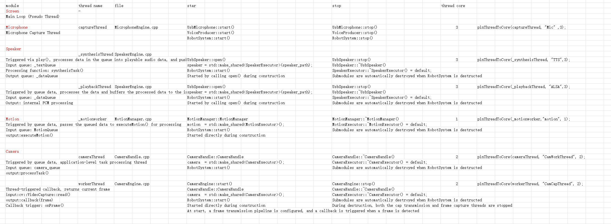

# CogniArm: A Learnable Robotic Arm System

---

## 📚 Table of Contents

- [Introduction](#introduction)
- [Features](#features)
- [System Architecture](#system-architecture)
- [Technical Documentation](#technical-documentation)
- [Project Structure](#project-structure)
- [Hardware Requirements](#hardware-requirements)
- [Quick Start](#quick-start)
- [Module Testing](#module-testing)
- [Tips for voice interaction](#tips-for-voice-interaction)
- [v2.0 Highlights](#v20-highlights)
- [Known Issues](#known-issues)
- [Team Contribution](#team-contribution)
- [License](#license)

## Introduction

As of April 13, 2026, the first version of our project has been officially released.

**Latest Update (CogniArm 2.0 – 20 April 2026):**
- Improved the Quick Start section [Quick Start](#quick-start)
- Added hardware connection documentation [Hardware](#hardware-requirements)
- Added an individual module testing section[Module Test](#module-testing)
- Added voice interaction guidance [Voice Interaction](#tips-for-voice-interaction)
- Designed more documents and self inspections on scoring criteria [Technical Documentation](#technical-documentation)
- Introduced CogniArm v2.0 highlights with detailed description of updates [v2.0 Highlights](#v20-highlights)

This project is a real-time embedded robotic system based on C++, designed with a Producer–Decision–Executor-Supervisor architecture.  
It supports voice interaction, visual perception, and motion learning.

**CogniArm is not just a robotic arm that can move**  

**it is more like a prototype of an embedded intelligent agent that can learn, understand, and execute tasks.**


For a detailed overview, see [Project Overview](#cogniarm-a-learnable-robotic-arm-system_),These documents also include the initial project planning during the early development stage, as well as several minor updates made prior to the official release.


---

##  Features

- 🎤 Speech recognition and command parsing (Microphone + NLU)
- 👁️ Visual detection (OpenCV)
- 🤖 Motion learning and execution system
- 🧠 Producer–Decision–Executor-Supervisor architecture (enhanced in v2.0)
- 🖥️ Embedded UI based on LVGL

---

##  System Architecture

The system adopts a three-layer architecture:

~~See details: [System Architecture](#version-update-v20)~~

(update in version 2.0 -- CogniArm structure 3.0)

<p align="center">
  
</p>

- **Producer (Input Layer)**
  - Microphone (speech input)
  - Camera (visual input)
  - Screen (UI input)

- **Brain (Decision Layer)**
  - RobotBrain (state machine + task scheduling)

- **Executor (Execution Layer)**
  - MotionExecutor (motion execution)
  - SpeakerExecutor (speech feedback)
  - CameraExecutor (feature matching)

- **Supervisor (Feedback Layer)**
  - Task feedback (provides real-time execution status to the Brain)
  - Task latency tracking (records execution time for performance analysis)

[back to Contents](#-table-of-contents)

---

## Technical Documentation

During the version update process, a number of technical documents were designed and organized under the path:
 ***docs/Technical_Documentation***

### Memory_Management

To ensure orderly system startup and shutdown during runtime, and to prevent memory leaks, a System Lifecycle & Execution Flow was designed.
This guarantees that thread initialization follows the correct order relative to object instantiation, and that all threads are safely stopped and properly released.

***docs/Technical_Documentation/Memory_Management.xlsx***

### SOLID_Analyze

In accordance with course requirements, a SOLID design analysis was conducted on all classes and functions within the system.  
Although some parts of the design do not fully comply with SOLID principles, the analysis provides a clear evaluation of the current structure. 

***docs/Technical_Documentation/SOLID_Analyze.xlsx***

### System_Architecture

The system architecture diagram has been redesigned for the latest version, providing a clear overview of the overall system structure. 

***docs/Technical_Documentation/System_Architecture.xlsx***

### Thread_Analyze

A comprehensive analysis of all thread lifecycles was conducted to ensure that threads are initialized within a unified function.  
All threads are explicitly bound to designated CPU cores to guarantee controlled execution and consistency.

***docs/Technical_Documentation/Thread_Analyze.xlsx***


### Sleep_Analyze

we conducted a thorough review of all sleep/usleep usages within the project.

We acknowledge that a small number of such calls still exist in the current version.   
However, these are not used to implement core task scheduling logic, but are instead the result of deliberate engineering trade-offs based on the following considerations

***docs/Technical_Documentation/Sleep_Analyze.xlsx***

### Latency_Assessment

We conducted latency evaluations on the main system modules,

From the data, it is evident that, following our optimizations, the execution time of the speaker module has been significantly reduced.

detailed results provided in 

***docs/test_data/Analysis.xlsx***.

[back to Contents](#-table-of-contents)

---

## Project Structure

```bash
src/
├── brain/                # Decision layer (core logic)
├── driver/               # Hardware abstraction layer
├── engines/              # Low-level hardware drivers
├── executors/            # Task execution layer
├── producers/            # Input layer
├── system/               # system mode setting(enhanced in v2.0)
├── supervisor/           # Task feedback and task latency record(enhanced in v2.0)
├── kinematics/           # Object grasping(enhanced in v2.0)
├── ui/                   # User interface (LVGL)
├── utils/                # Utility modules


third_party/              # External dependencies
learning_data/            # Learned data (features / motions)
hardware/                 # Hardware design files
docs/                     # Documentation
test/                     # task latency record(enhanced in v2.0)

CMakeLists.txt          
README.md               
main.cpp
setup.sh                  # Automated dependency setup(enhanced in v2.0)

```
[back to Contents](#-table-of-contents)

---

## Hardware Requirements

| Component        | Model / Specification                | Description                          |
|------------------|-------------------------------------|--------------------------------------|
| Main Controller  | Raspberry Pi 5 (4GB)               | Core processing unit                 |
| Camera Module    | Raspberry Pi Camera Module 3       | Vision input                         |
| Microphone       | VEETOP USB Microphone              | Audio input                          |
| Speaker          | USB Speaker                        | Audio output                         |
| Servo Driver     | PCA9685                            | PWM controller (I2C)                 |
| Servos           | MG996R (x3), MG90 (x1)             | Robotic arm actuators                |
| Display (Optional)| OSOYOO 3.5-inch DSI touchscreen   | User interface                       |
| Robotic Arm      | EEZYbotARM Mk2                     | Mechanical structure                 |
| Power Supply     | External 5V Power Supply (for PCA9685) | Required for stable servo operation |


[back to Contents](#-table-of-contents)

---

## Quick Start

Follow these steps to set up the environment and verify your hardware before running the project.

### step 0: Assembly of robotic arm

The overall reproduction of this project relies on the robotic arm, 

and the 3D printing drawings and installation methods of the robotic arm are as follows:

- *Ref:* [Instructables Guide](https://www.instructables.com/EEZYbotARM-Mk2-3D-Printed-Robot/) | [Thingiverse Files](https://www.thingiverse.com/thing:1454048)

We provide. 3mf files that may be used for 3D printing, with the following path:

*hardware/3mf*

*hardware/_3mf/EBAmk2.3mf*

#### Note

**If you have already assembled the robotic arm**, it may exhibit large or unexpected movements during the initial startup, possibly even exceeding its mechanical limits. This is because the initial servo values may have been modified.

Please interrupt the program during execution using Ctrl + C, and then adjust the initial configuration of each servo in the file *include/common/servo_config.hpp*.

**If you have not yet assembled the robotic arm**, please connect the wiring (servo → PCA9685 → Raspberry Pi 5) before mounting the servos onto the arm, and run the program once.

After that, please do not manually adjust the servo angles when the program is stopped. Thank you.

Minor angle adjustments are fine. The initial angles and angle limits can be modified at any time during later use in *include/common/servo_config.hpp*.

### step 1: Hardware connection

Please connect the Raspberry Pi 5 to the hardware according to the diagram or table below.


<p align="center">
  
</p>


#### Raspberry Pi to PCA9685 Connection
| Raspberry Pi Pin | PCA9685 | Function |
|------------------|--------|----------|
| Pin 1            | VCC    | Power    |
| Pin 3            | SDA    | Data     |
| Pin 5            | SCL    | Clock    |
| Pin 6            | GND    | Ground   |


#### Servo Wiring
| Wire Color | Function |
|-----------|----------|
| Brown     | GND      |
| Red       | VCC (+5V)|
| Yellow    | PWM      |

#### Note
> The screen is not required. You can use VNC to connect to and control the Raspberry Pi remotely.
>
> **Do NOT** connect the MG996R servo directly to the Raspberry Pi 5. During operation, please use an external power supply to power the PCA9685 board.


---

### step 2: Clone

After connecting the hardware, please connect the Raspberry Pi 5 to your computer.   
If you encounter any issues at this step, refer to [Setup Guide](docs/helper/setup_guide.md), which contains relevant instructions for connection as well as some Raspberry Pi commands.  

After ensuring that your computer is properly connected to the Raspberry Pi 5, please run the following command to clone our repository.

```bash
git clone https://github.com/milars-z/Real-Time-Embedded-Programming.git
```

---

### Step 3: Environment Setup

libasound2-dev         -- ues for microphone and speaker
nlohmann-json3-dev     -- json file process
libopencv-dev          -- image processing
libsdl2-dev            -- use for screen
libcamera-apps         -- use for camera
gstreamer1.0-libcamera -- use for camera
libcamera-v4l2         -- use for camera
libonnxruntime-dev     -- use for inference engine
cmake                  -- general package
build-essential        -- general package

You can choose either of the following methods to install the required dependencies.

- 1. command(You can manually install any packages you are missing)

```bash
sudo apt update
sudo apt install -y build-essential libasound2-dev nlohmann-json3-dev libopencv-dev
sudo apt install -y libsdl2-dev libcamera-apps gstreamer1.0-libcamera libcamera-v4l2 libonnxruntime-dev
```

- 2. bash

```bash
cd Real-Time-Embedded-Programming
bash setup.sh
```

This step may take a considerable amount of time and could require **more than 10 minutes**. Please be patient.  

---

### Step 4: Camera Verification 
Ensure your camera is correctly connected and recognized by the system.  

```bash
rpicam-hello --list-cameras
```

Check: If no camera is detected, please check the ribbon cable connection.

---

### Step 5: Enable I2C Interface

The robot arm's servo controller requires I2C communication.
Open and edit the configuration file:
```bash
sudo nano /boot/firmware/config.txt
```

Ensure the following line is present and not commented out:
```bash
dtparam=i2c_arm=on
```
Save and Exit (*Ctrl+O*, *Enter*, *Ctrl+X*), then **reboot** your Raspberry Pi.

or you can activate your iic in command
```bash
sudo raspi-config
```

choose 3-Interface Options  
choose I5 - IIC  
Yes  

---

### Step 6: Audio Hardware Configuration

Audio devices often vary. You must verify your speaker and microphone names and update the project configuration if necessary.

- 1.Check Recording Device (Microphone)

```bash
arecord -l
```
Look for the name inside the [].  
Requirement: The name should contain UACDemo.  
Example: card 2: UACDemoV10 [UACDemoV1.0], device 0...  

If it does not contain UACDemo, you must manually update the device string in include/commom/config.h  
edit SPEAKER_NAME  

- 2.Check Playback Device (Speaker)
```bash
aplay -l
```
Look for the name inside the [].  
Requirement: The name should contain USB PnP.  
Example: card 2: Device [USB PnP Sound Device], device 0...  

If it does not contain USB PnP, you must manually update the device string in include/commom/config.h  
edit MIC_NAME  

---

### Step 7:build and start!

```bash
cd Real-Time-Embedded-Programming
mkdir build
cd build
cmake ..
make
./main
```

### Note:

The screen is not required for this project, but it is recommended to use one for a better and easier experience (as the NLU and voice control are not very stable at this stage).

If no screen is available, it is recommended to use VNC for viewing and control. The configuration requirements are as follows:

```bash
sudo raspi-config
``` 

choose 3-Interface Options  
choose I3 - VNC  
Yes  

Then you can use VNC to connect to the Raspberry Pi and view the screen in real time.

### After runing

The system should print initialization logs:

<p align="center">
  
</p>

Or it may directly display the initial interface, as shown in the figure below.

<p align="center">
  
</p>

You can also check the command output window again to determine whether the program has started successfully. During the startup phase, under normal conditions, all outputs should be in the format **[Init] xxxx**  

If everything is working properly, feel free to enjoy interacting with the robot. You can try clicking motion to teach it a new motion, or camera to let it learn a new object feature. You can also change its name or how it addresses you.
Here are some tips for voice interaction [Tips for Voice Interaction](#tips-for-voice-interaction)


### Note
> It is strongly recommended to use an external power supply for the PCA9685 board instead of powering servos directly from the Raspberry Pi.

[back to Contents](#-table-of-contents)

---

## Module Testing

If you encounter persistent errors during the full system test, or if you do not have all the required hardware, you can use individual module testing to experience specific functionalities of the system.

In this project, you can use the following commands to test each module independently:

```bash
./main --test speaker
./main --test camera
./main --test motion
./main --test microphone
```

### Speaker

Used to test the speaker module’s ability to continuously output audio and evaluate the speech processing speed.

We have implemented full text caching in the system. For longer sentences, only the first playback requires significant time to generate PCM data. Subsequent playback will be much faster.

Test data can be found in:
`test/speaker_test.txt`

---

### Camera

This module requires a screen or VNC to view the results.  
You may also try voice control (not recommended).  

Tips for voice interaction can be found in: [Tips for Voice Interaction](#tips-for-voice-interaction)

This test allows you to measure the time required for camera detection.

---

### Motion

This module requires a screen or VNC.  

Since this is an isolated module test, only screen-based interaction is enabled. It is used to measure the response time from when the user presses a button to when the robotic arm begins executing the motion.

---

### Microphone

This module is used to test the microphone’s speech recognition capability as well as the NLU processing performance.

Results can be observed directly in the console output.

---

All test logs can be found in the `test` directory.

We also conducted a series of tests during the development of the project. Detailed test results can be found in docs/test_data

**You may also modify the underlying code to test your own modules or extend the system functionality.**

[back to Contents](#-table-of-contents)

---

## Tips for voice interaction

### basic commond

Due to limitations in the current NLU implementation and microphone performance, speech recognition may not be highly accurate. The following commands are reliably recognized and can help you quickly interact with the system using voice:

| Command                            | Intent        | Value  |
|-----------------------------------|--------------|--------|
| `hello`                           | greet                | —      |
| `what's my name`                  | check_host           | —      |
| `what's your name`                | check_robot          | —      |
| `i teach you how to dance`        | learn_motion         | dance  |
| `do motion dance`                 | do_motion            | dance  |
| `this is apple`                   | learn_object         | apple  |
| `find the apple`                  | find_object          | apple  |
| `reset`                           | reset                | —      |
| `update`                          | update_background    | —      |

### Motion Learning Command Mapping

During the motion learning phase, voice commands are mapped into joint control actions as follows:

#### Joint Selection

| Command    | Target Joint |
|------------|-------------|
| `base`     | Base        |
| `shoulder` | Shoulder    |
| `elbow`    | Elbow       |
| `hand`     | Hand        |

---

#### Direction Control

| Command      | Action Direction |
|--------------|------------------|
| `left`       | Move left        |
| `right`      | Move right       |
| `up`         | Move up          |
| `down`       | Move down        |
| `forward`    | Move forward     |
| `back`       | Move backward    |

---

#### Control Commands

| Command            | Function            |
|--------------------|---------------------|
| `finish` / `stop` / `done` | Exit learning mode |

---

> **Note**
> Direction commands are shared across all joints.
>
> It is recommended to avoid using `down`, as it may be confused with `done`.  
> Instead, use `left` or `back` as alternative commands when possible.


### Usage Notes

Please keep the following points in mind during usage. Although the robot provides feedback, these tips will help ensure better performance:

1. Before performing object learning or detection, please update the background and ensure that the scene remains relatively stable. After the robotic arm locates an object, it may block the camera and affect detection. For more reliable results, it is recommended to perform a `reset` beforehand.

2. The robotic arm may occasionally enter motion learning mode unintentionally. In this mode, only motion-related commands will be processed correctly. All other inputs will receive the response: `what's do you mean`.  
You can exit this mode by using the `finish` command or by clicking **confirm** on the screen.

[back to Contents](#-table-of-contents)

---

## v2.0 Highlights

### 1. Supervisor Node

In this update, a **Supervisor module** has been introduced. This module feeds the results of motion and camera tasks back to the Brain and provides real-time feedback based on task execution. For example, it can indicate when an object is not found, guide the robotic arm to point to a detected object, and confirm whether a motion has been successfully learned, making the system more intuitive and user-friendly.

With the introduction of the Supervisor, we have also added **task latency measurement**. The execution time of each task is recorded in logs, helping analyze system performance. Detailed test results can be found here: [link]

---

### 2. Module Test

In addition, we have decoupled the system modules and introduced individual module testing. Detailed instructions can be found here: [Module Test](#module-testing).

These tests are lightweight and allow you to observe the true latency of each module without interference from others. This demonstrates that the system is driven by a thread- and callback-based architecture, where tasks are executed independently without blocking each other.

---

### 3. Speaker Optimization

Based on our profiling results, we found that the speaker module introduced significant latency. To address this, we implemented a **speech caching mechanism** in this update.

The system preloads and caches PCM data for commonly used text during startup. In addition, newly encountered text is cached dynamically after first processing. This approach significantly reduces the runtime latency of the speaker module.

Detailed performance data can be found here: [link]

This optimization highlights the trade-off between memory usage and response time, favoring lower latency for interactive performance.

---

### 4. Microphone Pipeline Improvement

Similarly, we improved the reliability of speech recognition. Although a more advanced STT model has not yet been adopted, we optimized the data pipeline by introducing a **buffer queue** between the audio callback and the STT processing stage.

This reduces the workload of the callback function and ensures stable data ingestion during STT processing. As a result, the system becomes more robust under continuous input and is better prepared for integrating more computationally intensive STT models in the future.

---

### 5. Settings Interface

A **Settings interface** has been introduced in this version.

Currently, this page is used to modify the `hostname` and `robotname`. More importantly, it serves as a foundation for future extensions, such as supporting multi-language modes.

In addition, commonly used fixed text has been centralized into a dedicated text configuration, preparing the system for easier expansion and integration of new features in future updates.

[back to Contents](#-table-of-contents)

---

## Known Issues

The current version still has several limitations:

1. **Large NLU Model Size**  
   The current ONNX-based NLU model is large and resource-intensive,  
   with limited performance in embedded environments.
   The NLU model size has been optimized in v2.0. However, recognition accuracy is still limited and requires further training and data refinement.


2. **~~Speaker Latency~~**  
   ~~The speech feedback system suffers from noticeable latency.~~

   This issue has been improved in v2.0. See details in [v2.0 Highlights](#v20-highlights).


3. **Limited Camera Capability**  
   The current vision module can only detect simple features.

   **Future improvements:**
   - More robust detection models  
   - Support dynamic environments

   Camera detection accuracy remains a limitation in v2.0. While larger models could improve accuracy, they introduce higher computational overhead, making it difficult to maintain stable, low-latency performance when multiple modules run concurrently.

   Future improvements will explore deploying more advanced models on higher-performance platforms.

4. **Basic UI Functionality**
    The current UI is relatively simple and mainly supports basic interaction.

    **Planned improvements:**
    ~~- Host/robot name display and configuration~~
    - Language switching (maybe in ver2.5)
    - Visualization of learned motions and detection results (no need now)

5. **Object grasping and precise recognition are not currently supported**

    The current hardware setup does not support object grasping. If the project is further developed in the future, more advanced robotic arms or robotic platforms may be used to enable grasping capabilities.

6. **Develop commit**
    During the transition from module-based development to the Producer–Brain–Executor architecture, a major merge was performed from the `integration_micro_motor` branch into `main`.

    This merge consolidated previous development history, which may make the commit timeline appear partially non-continuous.  

    If any development records around April seem missing, please refer to the `integration_micro_motor` branch for the complete history.

[back to Contents](#-table-of-contents)

---

## Team Contribution

| Name            | Responsibility                                                                 |
| ---------       | ------------------------------------------------------------------------------ |
| Ziyin Zeng      | System architecture design, core module implementation, system integration，and hardware selection and assembly |
| Shantong Wang   | Social media, video production, and camera–motion coordinate transformation                       |
| Longyi Chen     | YOLO model design, system testing data analysis and text translation                                       |
| Dingyan Guo     | 3D printing, integrate hardware modules list and text translation                              |
| Hang Liu        | IK documentation                                                       |

[back to Contents](#-table-of-contents)

## License

GPL License

---

---

# CogniArm: A Learnable Robotic Arm System_

> **A cross-disciplinary embedded system project integrating Computer Vision, Speech Recognition, and Robotic Kinematics.**

## 📖 Project Overview
CogniArm is an intelligent robotic arm system designed with **learning capabilities**. Unlike traditional robots with fixed routines, CogniArm can be "taught" to recognize new objects through user interaction, storing visual features for future retrieval and autonomous grasping.

---

## 🏗 System Architecture
The system is built on five modular pillars:
*   **Vision Module**: Handles object detection and feature extraction. Includes *Learning Mode* (saving central object features) and *Recognition Mode* (vector matching).
*   **Speech Recognition Module**: Processes user voice commands and extracts keywords for instruction generation or visual search.
*   **AI Module**: Acts as the **Feature Extraction Engine**, supporting both visual and auditory intelligence.
*   **File Management Module**: Manages the persistence of pre-stored information groups and feature vectors.
*   **Control Module**: Executes motion planning and hardware-level control.

---

## 📅 Development Roadmap

### Stage 1: Hardware Foundation & Simulation (01/28 – 02/15)
- [x] **Physical Assembly**: 3D print and assemble the **EEZYbotARM Mk2**.
    - *Ref:* [Instructables Guide](https://www.instructables.com/EEZYbotARM-Mk2-3D-Printed-Robot/) | [Thingiverse Files](https://www.thingiverse.com/thing:1454048)
- [x] ~~**Digital Twin**: Implement Python-based simulation (PyQt/PySide) for synchronized movement.(This module will be developed in the middle of the project)~~
- [x] **Low-level Control**: Establish Raspberry Pi GPIO control with multi-threading.
- [x] **Speech/Vision Baseline**: Implement basic keyword extraction and image matching benchmarks (accuracy & blurriness analysis).

### Stage 2: Embedded Deployment & Kinematics (02/23 – 03/09)
- [x] **Embedded Migration**: Transition control from PC to standalone embedded deployment.
- [x] **Kinematics Foundation**: Implemented 3D coordinate system transformations (Homogeneous Transformation, Pixel-to-Base) with dynamic configuration and workspace safety boundaries.
- [x] **System Integration**: Synchronous display between the physical arm and simulation.

### Stage 3: Intelligent Perception (03/10 – 04/03)
- [x] **Voice Control**: Deploy full voice command chain for directional movement and grasping.
- [x] **Object Matching**: Real-time identification of desktop objects against existing image datasets.
- [ ] **Hardware Iteration**: (Optional) Refine 3D printed components for better grip/accuracy.

### Stage 4: Advanced Learning (Independent Track)
- [x] **Learning Workflow**: Expand file system for keyword-based image vector storage and retrieval.

---

## 🚩 Key Milestones
- [ √ ] **Lunar New Year (Feb 15)**: Prototype verification (Physical arm is fully mobile).
- [ √ ] **Early March**: Standalone embedded control (PC-independent).
- [ √ ] **Early April**: Full deployment of Speech and Image Recognition systems.

---

## 🛠 Final Phase & Maintenance
The final weeks will be dedicated to:
*   **Optimization**: Bug fixes and accuracy calibration.
*   **Documentation**: Code standardization, GitHub repository refinement, and **Thesis writing**.
*   **DevLogs**: Multimedia video documentation will be synchronized for each stage to showcase progress.

---

### 📝 Note
*Stage 4 development is handled as an independent advanced track.*


## 📌 Progress Summary (as of 02/04)  V 1.5

As of April 2th, the basic system framework has been successfully established.  
The intended architecture is shown in the diagram below.


### ✅ Current Capabilities

- Robotic arm can learn and execute predefined motion sets  
- Object detection and recognition are functional  
- Basic speech recognition and interaction are implemented  
- Coordinate Transformation: Successfully mapping 2D camera pixels to 3D physical base coordinates with safety validations.
---

## ⚠️ Current Limitations

- Motion recording process is cumbersome and inefficient  
- NLU accuracy is limited; text output from the speaker module is not always reliable  
- Camera module can only distinguish objects that are relatively far apart  
- Full Inverse Kinematics (IK) is not yet implemented (though the coordinate transformation baseline is now complete).
---

## 🚀 Next Steps

### 1. Interface & Usability
- Introduce a screen interface  
- Enable manual motion recording  
- Support remote visualization of camera detection results  
- Goal: Fully operate without reliance on a PC  

### 2. NLU Optimization
- Improve model accuracy and intent recognition  
- Enhance robustness of speech-to-text pipeline  

### 3. Camera Module Enhancement
- Improve detection accuracy  
- Allocate more memory for better performance  
- Optimize usage since the camera is only activated during detection/recognition tasks  

### Note
- The current 3D-printed model is sufficient for now, so no reprinting was required.

---

## 📊 Notes

- Current system focuses on modular integration  
- Next phase emphasizes optimization, usability, and system independence  


## Version Update V2.0

This release introduces a major refactor of the system architecture, transitioning to a structured **Producer–Brain–Executor** model.

The overall system workflow is illustrated in the diagram above.

## System_Architecture



### Key Changes

- Introduced a Screen module
- Unified input handling by treating both Screen and Microphone as producer modules
- Part of the Screen module was designed with AI assistance
- Updated camera parameters for improved performance

### Improvements

- Conducted a full system-level review to ensure proper thread lifecycle management
- For more details, please refer to docs/Project_Planning/overall.xlsx



### Known Issues

- Thread start/stop behaviors are not yet fully unified
- This will be addressed in future updates

[back to Contents](#-table-of-contents)


