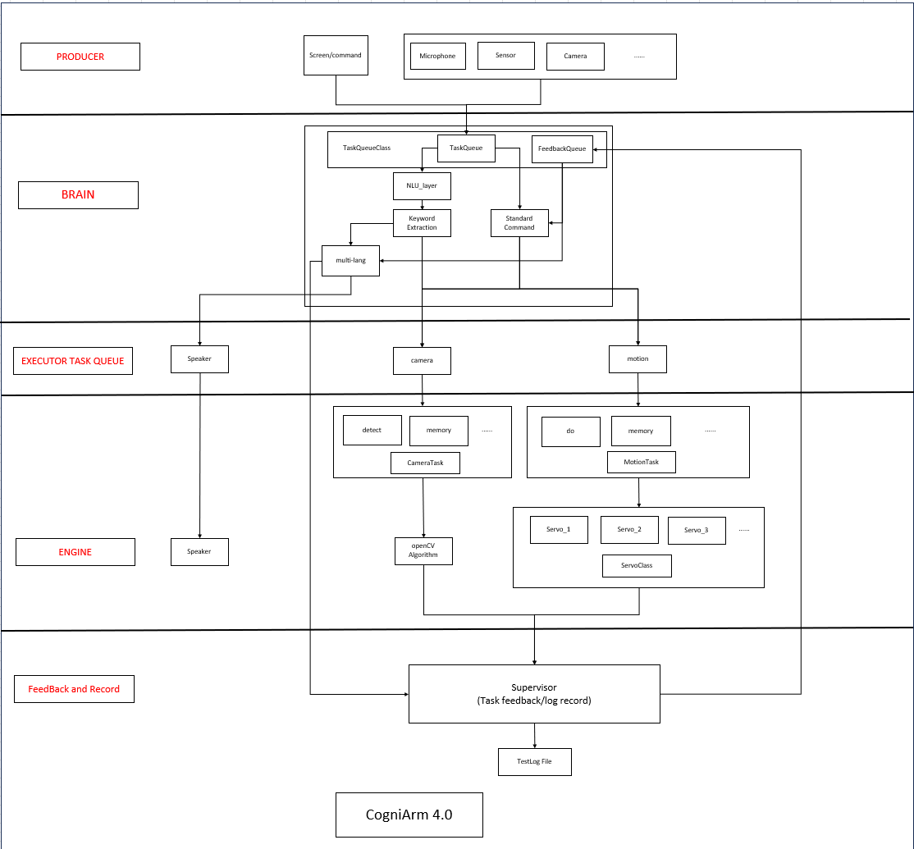

# ROADMAP

本文件详细记录了本项目的开发历程、各个版本的里程碑更新以及对未来的规划。
This document maintains a comprehensive record of the project's evolution, including development milestones, version updates, and future strategic roadmaps.

## Table Of Contents

- [v2.0 Highlights](#v20-highlights)
- [Future Work](#future-work)
- [Previous Research](#previous-research)

--- 

## v2.0 Highlights

### 1. Supervisor Node

In this update, a **Supervisor module** has been introduced. This module feeds the results of motion and camera tasks back to the Brain and provides real-time feedback based on task execution. For example, it can indicate when an object is not found, guide the robotic arm to point to a detected object, and confirm whether a motion has been successfully learned, making the system more intuitive and user-friendly.

With the introduction of the Supervisor, we have also added **task latency measurement**. The execution time of each task is recorded in logs, helping analyze system performance. Detailed test results can be found here: [Latency Testing](./test_data/TEST.md#latency-testing)

---

### 2. Module Test

In addition, we have decoupled the system modules and introduced individual module testing. Detailed instructions can be found here: [Module Test](./test_data/TEST.md#module-testing).

These tests are lightweight and allow you to observe the true latency of each module without interference from others. This demonstrates that the system is driven by a thread- and callback-based architecture, where tasks are executed independently without blocking each other.

---

### 3. Speaker Optimization

Based on our profiling results, we found that the speaker module introduced significant latency. To address this, we implemented a **speech caching mechanism** in this update.

The system preloads and caches PCM data for commonly used text during startup. In addition, newly encountered text is cached dynamically after first processing. This approach significantly reduces the runtime latency of the speaker module.

Detailed performance data can be found here: [link]

This optimization highlights the trade-off between memory usage and response time, favoring lower latency for interactive performance.

---

### 4. Microphone Pipeline Improvement

Similarly, we improved the reliability of speech recognition. Although a more advanced STT model has not yet been adopted, we optimized the data pipeline by introducing a **buffer queue** between the audio callback and the STT processing stage.

This reduces the workload of the callback function and ensures stable data ingestion during STT processing. As a result, the system becomes more robust under continuous input and is better prepared for integrating more computationally intensive STT models in the future.

---

### 5. Settings Interface

A **Settings interface** has been introduced in this version.

Currently, this page is used to modify the `hostname` and `robotname`. More importantly, it serves as a foundation for future extensions, such as supporting multi-language modes.

In addition, commonly used fixed text has been centralized into a dedicated text configuration, preparing the system for easier expansion and integration of new features in future updates.

[back to Main Contents](../README.md#-table-of-contents)

[back to Contents](#table-of-contents)

---

## Future Work

Based on recent testing and self-inspection, several architectural flaws were identified in v3.0.

To ensure future scalability and stability, a comprehensive architectural optimization is required.

### SOLID Compliance

Refactored modules in v3.0 that violated SOLID principles.

### Architectural Enhancement

Strengthened the Producer and Brain frameworks by introducing more specialized classes to handle complex tasks and improve extensibility.

### Flow Optimization

Streamlined the Supervisor's message-passing flow, making communication broader, faster, and more convenient.

  

[back to Main Contents](../README.md#-table-of-contents)

[back to Contents](#table-of-contents)

## Previous Research

## CogniArm: A Learnable Robotic Arm System_

> **A cross-disciplinary embedded system project integrating Computer Vision, Speech Recognition, and Robotic Kinematics.**

## 📖 Project Overview
CogniArm is an intelligent robotic arm system designed with **learning capabilities**. Unlike traditional robots with fixed routines, CogniArm can be "taught" to recognize new objects through user interaction, storing visual features for future retrieval and autonomous grasping.

---

## 🏗 System Architecture
The system is built on five modular pillars:
*   **Vision Module**: Handles object detection and feature extraction. Includes *Learning Mode* (saving central object features) and *Recognition Mode* (vector matching).
*   **Speech Recognition Module**: Processes user voice commands and extracts keywords for instruction generation or visual search.
*   **AI Module**: Acts as the **Feature Extraction Engine**, supporting both visual and auditory intelligence.
*   **File Management Module**: Manages the persistence of pre-stored information groups and feature vectors.
*   **Control Module**: Executes motion planning and hardware-level control.

---

## 📅 Development Roadmap

### Stage 1: Hardware Foundation & Simulation (01/28 – 02/15)
- [x] **Physical Assembly**: 3D print and assemble the **EEZYbotARM Mk2**.
    - *Ref:* [Instructables Guide](https://www.instructables.com/EEZYbotARM-Mk2-3D-Printed-Robot/) | [Thingiverse Files](https://www.thingiverse.com/thing:1454048)
- [x] ~~**Digital Twin**: Implement Python-based simulation (PyQt/PySide) for synchronized movement.(This module will be developed in the middle of the project)~~
- [x] **Low-level Control**: Establish Raspberry Pi GPIO control with multi-threading.
- [x] **Speech/Vision Baseline**: Implement basic keyword extraction and image matching benchmarks (accuracy & blurriness analysis).

### Stage 2: Embedded Deployment & Kinematics (02/23 – 03/09)
- [x] **Embedded Migration**: Transition control from PC to standalone embedded deployment.
- [x] **Kinematics Foundation**: Implemented 3D coordinate system transformations (Homogeneous Transformation, Pixel-to-Base) with dynamic configuration and workspace safety boundaries.
- [x] **System Integration**: Synchronous display between the physical arm and simulation.

### Stage 3: Intelligent Perception (03/10 – 04/03)
- [x] **Voice Control**: Deploy full voice command chain for directional movement and grasping.
- [x] **Object Matching**: Real-time identification of desktop objects against existing image datasets.
- [ ] **Hardware Iteration**: (Optional) Refine 3D printed components for better grip/accuracy.

### Stage 4: Advanced Learning (Independent Track)
- [x] **Learning Workflow**: Expand file system for keyword-based image vector storage and retrieval.

---

## 🚩 Key Milestones
- [ √ ] **Lunar New Year (Feb 15)**: Prototype verification (Physical arm is fully mobile).
- [ √ ] **Early March**: Standalone embedded control (PC-independent).
- [ √ ] **Early April**: Full deployment of Speech and Image Recognition systems.

---

## 🛠 Final Phase & Maintenance
The final weeks will be dedicated to:
*   **Optimization**: Bug fixes and accuracy calibration.
*   **Documentation**: Code standardization, GitHub repository refinement, and **Thesis writing**.
*   **DevLogs**: Multimedia video documentation will be synchronized for each stage to showcase progress.

---

### 📝 Note
*Stage 4 development is handled as an independent advanced track.*

## 📌 Progress Summary (as of 02/04)  V 1.5

As of April 2th, the basic system framework has been successfully established.  
The intended architecture is shown in the diagram below.

### ✅ Current Capabilities

- Robotic arm can learn and execute predefined motion sets  
- Object detection and recognition are functional  
- Basic speech recognition and interaction are implemented  
- Coordinate Transformation: Successfully mapping 2D camera pixels to 3D physical base coordinates with safety validations.
---

## ⚠️ Current Limitations

- Motion recording process is cumbersome and inefficient  
- NLU accuracy is limited; text output from the speaker module is not always reliable  
- Camera module can only distinguish objects that are relatively far apart  
- Full Inverse Kinematics (IK) is not yet implemented (though the coordinate transformation baseline is now complete).
---

## 🚀 Next Steps

### 1. Interface & Usability
- Introduce a screen interface  
- Enable manual motion recording  
- Support remote visualization of camera detection results  
- Goal: Fully operate without reliance on a PC  

### 2. NLU Optimization
- Improve model accuracy and intent recognition  
- Enhance robustness of speech-to-text pipeline  

### 3. Camera Module Enhancement
- Improve detection accuracy  
- Allocate more memory for better performance  
- Optimize usage since the camera is only activated during detection/recognition tasks  

### Note
- The current 3D-printed model is sufficient for now, so no reprinting was required.

---

## 📊 Notes

- Current system focuses on modular integration  
- Next phase emphasizes optimization, usability, and system independence  

## Version Update V2.0

This release introduces a major refactor of the system architecture, transitioning to a structured **Producer–Brain–Executor** model.

The overall system workflow is illustrated in the diagram above.

## System_Architecture

### Key Changes

- Introduced a Screen module
- Unified input handling by treating both Screen and Microphone as producer modules
- Part of the Screen module was designed with AI assistance
- Updated camera parameters for improved performance

### Improvements

- Conducted a full system-level review to ensure proper thread lifecycle management
~~- For more details, please refer to docs/Project_Planning/overall.xlsx~~(NO UES NOW)

### Known Issues

- Thread start/stop behaviors are not yet fully unified
- This will be addressed in future updates

[back to Main Contents](../README.md#-table-of-contents)

[back to Contents](#table-of-contents)
